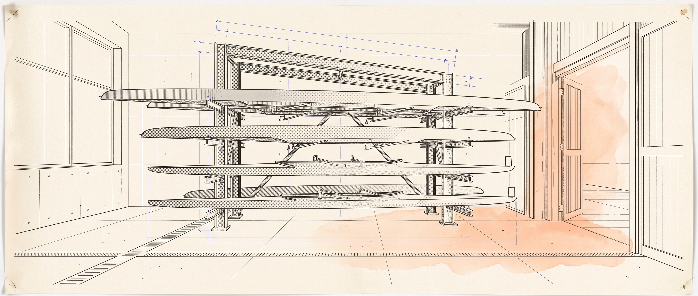

<picture>
  <source media="(prefers-color-scheme: dark)" srcset="assets/hero-ink.png">
  
</picture>

# Abishai Gosula
Founder, builder & CS student. I ship things that actually run.

Berkeley CS. I build full products end to end — schema, auth, app, marketing site, store
listing — and I don't call something done until I've run the whole flow against the real
database myself.

Most of what I work on is sports, faith, campus, and rowing software. Some of it is public
below. Some of it is private and shipping.

## The Rack

What I've built. Status is current, not aspirational.

| Project | What it is | Stack | Status |
|---|---|---|---|
| **Atlitos** | "The AI Coach in Your Pocket" — a sports coaching superapp | Expo · Next.js · Supabase · Turborepo | Building · [site](https://github.com/abishaigeorge09/atlitos-website) |
| **LaunchPad** | Startup incubation club platform — invite-gated applications, task/milestone/mentor workflows, rubric-based idea analyzer, RLS-scoped multi-role access | Next.js · Supabase · TypeScript | Private |
| **BelieversDiary** | BeReal, for Christians | Expo · Next.js · Supabase | TestFlight |
| **rowIQ** | Rowing erg-performance dashboard prototypes | TypeScript · Vite | [Public](https://github.com/abishaigeorge09/rowIQ) |
| **AGO Berkeley** | House recruitment site, scroll-driven 3D | Next.js · React Three Fiber · GSAP | Private |
| **Elsheph** | Client web work, maintained | Next.js · TypeScript | [Public](https://github.com/abishaigeorge09/elsheph-web-v2) |
| **salon-ar** | AR haircut try-on, native iOS | Swift · ARKit | [Public](https://github.com/abishaigeorge09/salon-ar) |

## How I work

- Verified over vibes. "It should work" isn't a status. I run the flow.
- Whole product, not the fun part. Auth, RLS, migrations, store listings, the boring 20%.
- One thing at a time, finished.

## Stack

TypeScript · Next.js · React · Expo / React Native
Supabase / Postgres (RLS-first) · Tailwind · Three.js / React Three Fiber
Swift + ARKit · Python
Vercel · EAS · Turborepo

## Contributions

  
  

## Talk to me

[abishaigosula.com](https://abishaigosula.com) · abishaigosula@gmail.com

Building something and need it to actually work? I'm reachable.
